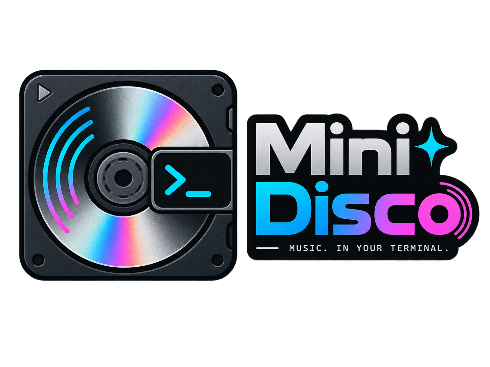

<p align="center">
  
</p>

# Mini Disco

Mini Disco is a standalone, Linux-first command-line tool for working with USB
NetMD MiniDisc devices. It can inspect an inserted disc, edit disc and track
metadata, upload converted audio or prepared raw audio, upload M3U playlists,
erase or delete tracks, eject the disc, and send basic playback commands.

The project is based on the NetMD behavior and hard-won device knowledge in
[Web MiniDisc](https://github.com/asivery/webminidisc), but it is not a fork of
that application. Mini Disco is its own Rust codebase with a terminal workflow,
and it vendors the Rust `minidisc` crate while upload behavior is being proven
against real hardware.

## Current Scope

Mini Disco currently targets Linux USB NetMD devices. It is focused on local
terminal workflows rather than browser support, remote devices, Hi-MD, factory
mode tools, or full Web MiniDisc feature parity.

It can:

- List supported NetMD devices connected over USB.
- Read disc title, groups, tracks, recording details, and remaining time.
- Print JSON for device and disc listings.
- Upload audio files after conversion through `ffmpeg`.
- Upload M3U/M3U8 playlists in order.
- Optionally erase the disc before a playlist upload.
- Optionally create a group around uploaded playlist tracks.
- Upload prepared raw SP, LP2, LP105, or LP4 audio bytes.
- Convert supported audio files into raw upload bytes without touching a disc.
- Rename discs and tracks.
- Delete one track or erase the whole disc.
- Eject the disc when the device supports software eject.
- Control playback with play, pause, stop, next, and previous commands.

## Requirements

- Linux.
- Rust and Cargo.
- A USB NetMD device with an inserted MiniDisc.
- USB permissions for your user.
- `ffmpeg` in `PATH` for normal audio-file uploads.
- `atracdenc` in `PATH` for LP2, LP105, and LP4 uploads.

For USB permission guidance, run:

```sh
cargo run -- doctor
```

Mini Disco needs permission to open the NetMD USB device. In practice that
usually means installing NetMD udev rules as `/etc/udev/rules.d/70-netmd.rules`,
reloading udev, and reconnecting the device.

## Running

From this repository root:

```sh
cargo run -- devices
cargo run -- list
```

Build a reusable local binary:

```sh
cargo build --release
./target/release/mini-disco devices
```

Install it from this source tree:

```sh
cargo install --path .
mini-disco devices
```

If more than one supported NetMD device is attached, list them first and pass the
1-based device number:

```sh
mini-disco devices
mini-disco --device 2 list
mini-disco --device 2 upload song.flac --title "A Good Track"
```

## Common Workflows

Inspect the current disc:

```sh
mini-disco list
mini-disco list --json
```

Upload a single track in SP mode:

```sh
mini-disco upload song.wav --title "Track Title"
mini-disco upload song.flac
```

Upload in an LP mode:

```sh
mini-disco upload song.mp3 --format lp2 --title "Long Play Track"
mini-disco upload song.flac --format lp105
mini-disco upload song.ogg --format lp4
```

Upload a playlist:

```sh
mini-disco upload-m3u album.m3u --format sp
mini-disco upload-m3u album.m3u --format lp2 --erase-first
mini-disco upload-m3u album.m3u --format lp2 --group
```

Playlist titles come from `#PLAYLIST`, or from `#EXTART` and `#EXTALB`, with the
playlist file name as a fallback. Track titles come from preceding `#EXTINF`
entries when present, otherwise from the source file name.

Edit disc metadata:

```sh
mini-disco rename-disc "Road Mix"
mini-disco rename-track 3 "New Track Title"
```

Delete content:

```sh
mini-disco delete-track 3
mini-disco erase
```

Control the attached device:

```sh
mini-disco play
mini-disco pause
mini-disco stop
mini-disco next
mini-disco prev
mini-disco eject
```

## Upload Formats

`upload` accepts any file that your installed `ffmpeg` can decode, such as WAV,
FLAC, MP3, AAC, or Ogg Vorbis.

- `sp` uses `ffmpeg` to produce 44.1 kHz stereo big-endian PCM and sends it over
  the normal NetMD PCM upload path.
- `lp2`, `lp105`, and `lp4` use `ffmpeg` to make a temporary WAV, then
  `atracdenc` to encode ATRAC3. Mini Disco strips the OMA header before
  transfer.

`upload-raw` is for already prepared bytes:

```sh
mini-disco upload-raw track.raw --format sp --title "Prepared Track"
```

For SP raw files, the input must be big-endian 16-bit stereo PCM. For LP modes,
the input must be headerless ATRAC3 frames.

You can test conversion without touching a disc:

```sh
mini-disco convert song.flac song-sp.raw --format sp
mini-disco convert song.flac song-lp2.raw --format lp2
```

## Safety Notes

Commands that change the disc refuse to write when the disc is not writable or
the write-protect tab is enabled. Upload commands check available capacity before
transfer when the device reports remaining time.

Track numbers are the 1-based numbers printed by `mini-disco list`.

## Project Layout

- `src/` contains the CLI application, audio conversion, M3U parsing, output
  formatting, and NetMD device boundary.
- `vendor/minidisc/` contains the vendored Rust `minidisc` crate used for NetMD
  protocol work.
- `docs/cli.md` has the command reference and implementation notes.
- `docs/adr/` records project decisions.

## Not Implemented Yet

The main deferred areas are terminal UI work, track download support,
factory-mode workflows, remote NetMD, Hi-MD, metadata lookup, local library
management, cross-platform support, and packaged releases.
